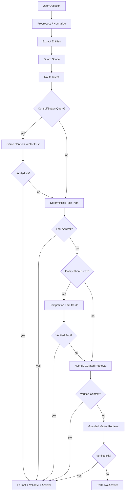

# Current System Flow

## ภาพรวม

PSU Esports Chatbot เป็นระบบตอบคำถามของ PSU Esports Studio - Phuket โดย production ปัจจุบันเน้นความถูกต้องและ guard มากกว่าการปล่อย LLM ตอบอิสระ

แนวหลัก:

```text
rulebase + deterministic fast path + curated RAG-lite + guarded vector retrieval + no-answer guard
```

## Flow จาก User ถามจนตอบ



## Route และ Mode ที่ควรรู้

ตัวอย่าง route category:

- `service_fee`
- `schedule`
- `equipment`
- `games`
- `competition_rules`
- `reservation`
- `events_news`
- `knowledge`
- `general`
- `no_answer`

ตัวอย่าง mode ที่เจอบ่อย:

- `pipeline:booking_howto_fast_path`
- `pipeline:games_full_catalog_count_fast_path`
- `pipeline:game_control_vector_first`
- `pipeline:guarded_vector_direct`
- `pipeline:hybrid_guarded_rerank`
- `pipeline:competition_fact_card`
- `pipeline:no_answer`

## Rulebase / Fast Path

อยู่หลัก ๆ ใน:

```text
app\runtime\fast_answer.py
```

ใช้ตอบเรื่องที่ควร deterministic:

- ราคา
- เวลาเปิด
- วิธีจอง
- รายชื่อเกม
- เกมอยู่โซนไหน
- อุปกรณ์มีอะไร
- คำถามพื้นฐานที่ต้องตอบเร็วและตรง

ข้อควรระวัง:

- ถ้าคำถามผิด ให้ดูว่า fast path แย่งตอบก่อน RAG/vector หรือไม่
- ถ้าต้องให้ข้อมูลใหม่ถูกใช้จริง บางครั้งต้องแก้ทั้ง data และ route/guard

## Curated RAG-lite

ข้อมูลอยู่ใน:

```text
data\curated
```

เหมาะกับ:

- facts ที่มี source ชัดเจน
- รายละเอียดเกม/อุปกรณ์
- knowledge page
- ข้อมูลที่ไม่อยาก hardcode ทั้งหมดใน fast path

## Guarded Vector Retrieval

อยู่ใน:

```text
app\pipeline\vector_retrieval.py
data\vector\psu_hybrid_vector_index.json
```

backend ปัจจุบัน:

```text
local_hash_char_ngram_v1
```

ข้อดี:

- ไม่เสียเงิน
- deploy บน Vercel ได้ง่ายกว่า embedding model ใหญ่
- รองรับ typo/สะกดเพี้ยนได้ระดับหนึ่งด้วย char n-gram

ข้อจำกัด:

- ยังไม่ใช่ semantic embedding model จริงแบบ E5/BGE
- ยังต้องใช้ alias/guard ช่วยในหลายกรณี
- ถ้าเปิดกว้างเกินไปจะเสี่ยงดึงเอกสารผิด

## Game Controls Vector First

งานล่าสุดเพิ่ม flow นี้:

- ถ้าคำถามมีสัญญาณเรื่องปุ่ม/จอย/การควบคุม เช่น `ปุ่ม`, `กดอะไร`, `จอย`, `button`, `controls`
- ระบบจะลองดึง category `game_controls` จาก vector ก่อน fast path เกมทั่วไป
- ถ้า match ได้ จะตอบรายการปุ่ม เช่น ปุ่มกระโดด ปุ่มวิ่ง ปุ่มโจมตี

ข้อมูลมาจาก:

```text
data\curated\game_control_facts.jsonl
data\control_game_split\ps5
data\control_game_split\nintendo
```

## No-Answer Policy

ถ้าไม่มีข้อมูลจริง:

- ห้ามเดา
- ห้าม fabricate
- ห้ามใช้ข้อมูลใกล้เคียงแบบมั่ว
- ให้ตอบสุภาพว่าไม่พบข้อมูลที่ยืนยันได้
- ถ้าเหมาะสม ให้แนะนำสอบถามเจ้าหน้าที่หรือเพจศูนย์

