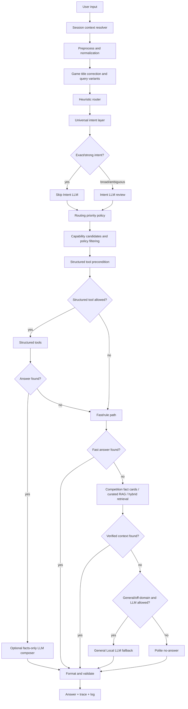

# Current System Flow - Local First

ระบบปัจจุบันเป็น chatbot สำหรับ PSU Esports Studio - Phuket ที่เน้น local-first และใช้หลายชั้นประกอบกัน ไม่ใช่ให้ LLM ตอบทุกอย่างโดยตรง

## ภาพรวม Pipeline



## Session Memory / Follow-up

Local chat และ notebook มี session memory:

- 1 รอบการเปิด terminal/notebook จะมี `SESSION_ID`
- ถามหลายครั้งใน session เดิมจะใช้ history ช่วย resolve follow-up
- เช่น:
  - `Mario Party คือเกมอะไร`
  - ต่อด้วย `มีปุ่มอะไรบ้าง`
  - ระบบควรเข้าใจว่าหมายถึง Mario Party ใน session เดิม
- ถ้า restart notebook หรือเปิด session ใหม่ จะได้ id ใหม่
- session เก่าถูกเก็บเป็น log แต่ไม่ได้เป็น memory สดของ session ใหม่

ไฟล์หลัก:

```text
app\session\context_resolver.py
tools\local_ai_chat.py
notebooks\04_local_hybrid_chat_debug.ipynb
```

## Preprocess / Normalization

ทำหน้าที่:

- ทำความสะอาด query
- normalize ภาษาไทย/อังกฤษ
- แก้ typo ยอดฮิต
- สร้าง query variants
- แก้ชื่อเกมที่พิมพ์ผิดด้วย `game_title_correction.py`

ไฟล์หลัก:

```text
app\pipeline\preprocess.py
app\core\normalization.py
app\pipeline\game_title_correction.py
```

ตัวอย่างที่ควรรองรับ:

- `tekkrn8` -> `TEKKEN 8`
- `valornat` -> `VALORANT`
- `msrio` / `mqrio` -> broad family `Mario`
- `คอลออฟดูตี้` -> broad family `Call of Duty`
- `ฟอทไน` -> `Fortnite`
- `วาโลแร้น` -> `VALORANT`

## Universal Intent

Universal intent แยกคำถามเป็น:

- `domain`: เช่น `games`, `members`, `equipment`, `reservation`, `service_fee`, `schedule`, `general`
- `operation`: เช่น `list`, `count`, `detail`, `how_to`, `control`, `price_calculate`, `role_lookup`
- `target`: สิ่งที่ถามถึง เช่นชื่อเกม ชื่อโซน ตำแหน่งคน

ไฟล์หลัก:

```text
app\pipeline\universal_intent.py
```

แนวคิดปัจจุบัน:

- exact/strong intent ข้าม LLM เพื่อให้เร็วและไม่เปลี่ยนคำตอบถูกให้ผิด
- broad/ambiguous intent ให้ Intent LLM review เพื่อเข้าใจคำถามกำกวม

ตัวอย่าง exact/strong:

- `VR ราคาเท่าไหร่`
- `PS5 เปิดกี่โมง`
- `TEKKEN 8 มีปุ่มอะไรบ้าง`
- `สมาชิก PSU Esport มีกี่หมวด`

ตัวอย่าง broad/ambiguous:

- `ตอนนี้สตาฟมีใครบ้าง`
- `เกมตอนนี้มีอะไรบ้าง`
- `อยากเล่นรถแข่งต้องใช้อะไร`
- `เกมแนว MOBA มีอะไรบ้าง`

## Local LLM ใช้ทำอะไร

ตอนนี้ Local LLM ไม่ได้ใช้แทนระบบทั้งหมด แต่ใช้ช่วยในจุดที่เหมาะ:

1. Intent LLM
   - ช่วยตีความคำถามกำกวม
   - ช่วยเลือก domain/operation
   - default ใช้ `qwen2.5:3b` ถ้าไม่ได้ตั้งอย่างอื่น

2. General LLM fallback
   - ใช้ตอบความรู้ทั่วไปนอก PSU ถ้าเปิด LLM และไม่ควรดึงข้อมูล PSU มาปน
   - เช่น `เมืองหลวงของประเทศไทยคืออะไร`

3. Facts-only composer
   - optional
   - ให้ LLM เรียบเรียงคำตอบจาก facts/draft ที่ verified แล้วเท่านั้น
   - ห้ามแต่ง facts ใหม่

4. Tool router
   - optional
   - ช่วยเลือก capability/tool ในกรณีที่ heuristic ยังไม่ดีพอ

## Structured Tools

Structured tools เป็นชั้นสำคัญสำหรับข้อมูลที่เป็น facts ชัดเจน:

- members
- games
- game controls
- equipment
- reservation
- schedule
- service fee

ไฟล์หลัก:

```text
app\pipeline\structured_tools.py
```

จุดที่ต้องจำ:

- คำถาม members เช่น `สมาชิกมีกี่หมวด`, `ตำแหน่งนี้ใครทำ` ควรตอบจาก structured member data
- คำถาม games เช่น `PS5 มีเกมอะไรบ้าง`, `Call of Duty มีเกมอะไรบ้าง` ควรตอบจาก structured game data
- คำถาม controls ต้องตอบทุกปุ่มที่มี ถ้าข้อมูลมีครบ

## Fast / Rule Path

ใช้สำหรับคำตอบ deterministic ที่ควรเร็วและแม่น:

- ราคา
- เวลาเปิด-ปิด
- วิธีจอง
- policy บางอย่าง
- game/equipment คำถามง่าย ๆ

ไฟล์หลัก:

```text
app\runtime\fast_answer.py
app\rules\matcher.py
```

ข้อควรระวัง:

- Fast/rule ที่มั่นใจเกินไปอาจแย่งตอบก่อน LLM/RAG แล้วทำให้ตอบผิด
- ถ้าคำตอบผิด ให้ดู mode ก่อนว่า fast path เป็นคนตอบหรือไม่

## RAG / Vector / Hybrid

ใช้สำหรับข้อมูล curated และเอกสารที่ไม่ควร hardcode ทั้งหมด

ไฟล์หลัก:

```text
app\pipeline\retrieval.py
app\pipeline\vector_retrieval.py
app\pipeline\hybrid_retrieval.py
data\vector\psu_hybrid_vector_index.json
```

Vector backend ปัจจุบันเป็น local hash char n-gram ไม่ใช่ semantic embedding model ใหญ่

ข้อดี:

- local
- ไม่เสียค่า API
- ดีต่อ typo ระดับหนึ่ง

ข้อจำกัด:

- ไม่เข้า semantic ลึกแบบ embedding model จริง
- ยังต้องใช้ alias/guard/structured tools ประกอบ

## Output / Validation / Formatting

ก่อนตอบต้องผ่าน:

- formatter
- validator
- Thai style post-process

ไฟล์หลัก:

```text
app\pipeline\formatter.py
app\pipeline\validator.py
app\core\thai_style.py
```

เป้าหมาย:

- ตอบตรงคำถาม
- ไม่ hallucinate
- format อ่านง่าย
- แหล่งข้อมูลถูกต้อง

